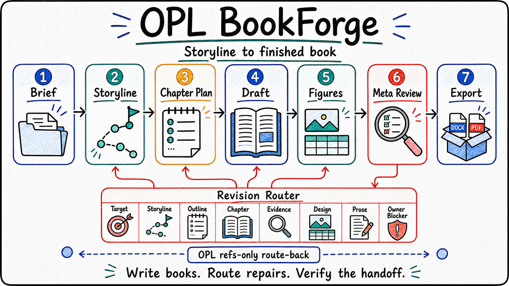

<p align="center">
  
</p>

<p align="center">
  <a href="./README.md"><strong>English</strong></a> | <a href="./README.zh-CN.md">中文</a>
</p>

<h1 align="center">OPL Book Forge</h1>

<p align="center"><strong>An OPL-standard book-writing agent for turning a storyline into a finished manuscript package</strong></p>
<p align="center">Storyline architecture · Chapter drafting · Figures and tables · Style control · Export handoff</p>

<!--
Owner: `opl-bookforge`
Purpose: `public_repository_entry`
State: `public_entry`
Machine boundary: Human-readable public entry. Machine truth remains in `contracts/`, `agent/`, OPL validator output, OMA Agent Lab evidence, pilot exports, owner receipts, typed blockers, and future runtime receipts.
-->

Writing a book is long-form delivery work. The hard part is keeping the reader promise, chapter logic, source grounding, voice, figures, tables, layout, and owner review on one line until the manuscript can be handed off.

`OPL Book Forge` is built around that work:

- What is the book's promise, audience, argument arc, and chapter thesis chain?
- Which source material supports each chapter, figure, table, and claim?
- Can chapters keep one voice across many drafting and revision passes?
- Can the prose read like human editorial writing, with direct affirmative phrasing and concrete language?
- Can exported DOCX/PDF files, figure plans, table plans, style reports, and owner gates stay traceable?

It organizes a two-stage route from storyline architecture to book materialization, then keeps quality checks and handoff evidence attached to the same book project.

<table>
  <tr>
    <td width="33%" valign="top">
      <strong>Who It Serves</strong><br/>
      Authors, experts, researchers, educators, and operators turning source material into a coherent book
    </td>
    <td width="33%" valign="top">
      <strong>What It Organizes</strong><br/>
      Storyline, chapter thesis chain, manuscript body, figure and table plans, style contract, quality reports, exports, and owner gates
    </td>
    <td width="33%" valign="top">
      <strong>How To Start</strong><br/>
      Provide the book brief, audience, source corpus, voice expectations, and desired export handoff
    </td>
  </tr>
</table>

<p align="center">
  
</p>

## Core Highlights

**Storyline First**<br/>
Book Forge starts with the book's premise, reader promise, source map, argument arc, chapter thesis chain, and style contract before materializing chapters.

**Book Materialization As A Stage**<br/>
The second stage produces chapter drafts, manuscript body, illustration plans, table plans, style reports, AI-flavor revision checks, layout QC, and export handoff refs.

**Voice And Style Stay Inspectable**<br/>
The style contract travels with the book project. Checks look for consistent terminology, concrete phrasing, affirmative editorial language, and repeated patterns that make prose feel generated.

**First Drafts Should Already Read Like Book Prose**<br/>
Book Forge keeps chapter tasks, target budgets, source refs, asset status, QC notes, and blockers in briefs and reports. The manuscript body is expected to open from reader-facing scenes, questions, tensions, and consequences instead of exposing production scaffolding.

**Figures, Tables, And Layout Are Part Of The Work**<br/>
Book Forge treats figures, tables, captions, export shape, rendered pages, and layout review as book-delivery surfaces.

**Meta Review Routes The Repair Level**<br/>
After whole-book review or serious critique, Book Forge decides whether repair starts at artifact target, storyline architecture, outline sequence, chapter function, evidence/model, publication design, local prose, or an owner/source blocker before editing.

**PDF Export Uses A Real Typesetting Backend**<br/>
Book Forge includes a native PDF export helper that compiles Markdown through Pandoc with XeLaTeX and renders pages for inspection when Poppler is available. Quarto book rendering and Typst are planned backend families for richer book projects.

**Publication Proof Has Its Own Gates**<br/>
Review PDFs remain progress-first reading checkpoints. Publication proofs add design tokens, component inventory, font readback, rendered-page QA, front matter and TOC cleanliness, page rhythm/density/orphan checks, asset coverage, and pre-ship proof review. Final export still requires owner/export acceptance.

**Owner-Gated Publication Boundary**<br/>
Book Forge can produce evidence, drafts, exports, and typed blockers. Publication approval, owner acceptance, and production-ready claims still require the right owner receipts and runtime evidence.

**Built Through OMA And Agent Lab**<br/>
This baseline includes OPL Meta Agent takeover evidence, independent AI reviewer evidence, and an external-suite self-evolution pass. New-agent delivery must go through that loop rather than ending at scaffold readiness.

## One-Sentence Quick Start

You can start with prompts like:

- "Use this source corpus to shape a book storyline, define the reader promise, chapter thesis chain, and style contract, then stop for owner review."
- "Turn this approved storyline into a short book manuscript with chapter drafts, figure plans, table plans, style checks, layout QC, and DOCX/PDF export handoff."
- "Run a whole-book meta-review and decide whether the repair should start from storyline, outline, chapter function, evidence/model, publication design, or local prose."

## What It Helps With

- Turning notes, source packs, lectures, reports, or research material into a book-shaped storyline.
- Keeping chapter logic, evidence references, voice, and editorial constraints coherent across a manuscript.
- Planning illustrations and tables before export, with captions and placement intent.
- Running style consistency, AI-flavor, wording, layout, and export checks as part of the book route.
- Producing handoff evidence that distinguishes generated drafts from owner-accepted publication material.

## Current Delivery Focus

- `storyline-architecture`: premise, reader promise, argument arc, source map, chapter thesis chain, style contract, and owner handoff.
- `book-materialization`: chapter draft bundle, manuscript body, figure plan, table plan, style consistency report, AI-flavor revision report, revision entrypoint decision, layout QC, exports, and owner handoff.
- `OMA Agent Lab`: baseline takeover suite, AI reviewer evaluation, mechanism proposal refs, external-suite self-evolution, and no-patch work-order receipt.
- `real book pilot`: a short-book pilot produced storyline artifacts, manuscript body, two PNG figures, table plan, DOCX/HTML/PDF exports, rendered PDF pages, quality receipts, and typed owner blockers.

## Current Boundary

- `OPL Book Forge` is an OPL-standard Foundry Agent domain pack for book authoring.
- In the OPL family, Book Forge is the book-authoring domain agent package: Book Forge keeps book authority, while OPL owns generic runtime, package carrier, generated wrapper, and hosted surfaces.
- OPL owns generated interfaces, framework runtime projection, Agent Lab, work-order execution, registry/discovery, and promotion gates.
- Book Forge owns book-domain truth, manuscript quality rules, style policy, figure/table planning, export/publication verdict boundaries, artifact authority, memory body, and owner receipts.
- Current evidence supports structural baseline, generated interface descriptors, OMA Agent Lab evaluation, and a real short-book pilot with export/render checks.
- Book Forge exposes a refs-only `OPL Ledger` artifact registration contract for long-term book deliverables: OPL Ledger may register refs, hashes, index refs, review refs, and receipt refs, while artifact bodies, verdicts, owner receipt bodies, typed blockers, queues, and provider attempts stay outside the registration surface.
- Current evidence does not authorize a production-ready book-writing claim. The real pilot remains `passed_with_owner_gate_blocker` / `production_ready_claim_allowed=false` until human owner acceptance and live OPL StageRun or hosted artifact-handoff parity evidence exist.

<details>
  <summary><strong>Technical OPL / operator boundary</strong></summary>

- The package exposes action contracts for `shape-storyline` and `materialize-book`; current generated MCP/OpenAI/AI SDK descriptors are descriptors only unless a runtime surface proves execution.
- `scripts/verify.sh` validates the OPL standard scaffold, generated interface descriptors, policy tests, helper doctor/self-test checks, and source hygiene through the local OPL CLI without compiling PDFs.
- `scripts/verify.sh pdf-smoke` runs the proof-backend PDF compile/render smoke and requires `pandoc` plus `xelatex`.
- OMA evidence lives under `docs/evidence/oma-agent-lab/`.
- The real pilot evidence lives under `docs/evidence/production-readiness/bookforge-real-book-pilot-2026-06-18/`.
- Pilot exports include DOCX, HTML, PDF, rendered pages, generated figures, quality receipts, and typed owner blockers. They are evidence artifacts, not owner publication acceptance.
- Kami-inspired publication proof rules are absorbed as Book Forge-owned domain contracts plus helper machine-baseline proof plumbing. They do not import Kami's visual language, WeasyPrint runtime, font installer, update checker, or a second proof truth source, and they do not replace human publication-design review, final-export acceptance, or owner proof readiness evidence.
- Scaffold validation, generated interface readiness, OMA takeover evidence, external-suite no-patch receipts, pilot exports, or rendered pages cannot become owner receipt, publication approval, production readiness, or hosted runtime parity by themselves.
- `contracts/opl_ledger_artifact_registration.json` is a refs-only registration contract and `contracts/generated_surface_handoff.json` exposes its OPL Ledger projection/readback locator. Ledger visibility is not manuscript body storage, owner acceptance, publication/final-export verdict, runtime queue, or provider-attempt authority.

</details>

## How To Read This Repository

1. Potential users should start here, then continue to the [Docs Guide](./docs/README.md).
2. Technical readers should read [Project](./docs/project.md), [Status](./docs/status.md), [Architecture](./docs/architecture.md), [Invariants](./docs/invariants.md), and [Decisions](./docs/decisions.md).
3. Operators should inspect `contracts/`, `agent/`, `docs/evidence/oma-agent-lab/`, and the real pilot evidence pack before making readiness or owner-acceptance claims.

## Agent And Operator Quick Start

<details>
  <summary><strong>Start here if you are handing this repo to Codex or another agent</strong></summary>

- Cloning this repo does not install the OPL Framework or a hosted Book Forge runtime. If hosted execution is needed, prepare the current `one-person-lab` checkout or release bundle first.
- Read this README, [Docs Guide](./docs/README.md), [Status](./docs/status.md), and `AGENTS.md` before editing.
- Treat `OPL Book Forge` as the book-domain owner and OPL as generated/runtime surface owner.
- Use OMA / Agent Lab evidence when evaluating the baseline. Do not stop at scaffold or interface validation when claiming a new-agent delivery is complete.
- Keep publication, export acceptance, and production-ready claims fail-closed until owner receipts and runtime parity evidence exist.

</details>

## Commands

```bash
scripts/verify.sh
scripts/verify.sh pdf-smoke
python3 runtime/native_helpers/bookforge_pdf_export.py --doctor
python3 docs/evidence/production-readiness/bookforge-real-book-pilot-2026-06-18/tools/verify_pilot.py
```

`scripts/verify.sh` is the default local structural verifier. `scripts/verify.sh pdf-smoke` is the explicit proof-backend lane for PDF compile/render behavior; it does not prove publication approval, final-export readiness, or owner acceptance. The pilot verifier checks the existing pilot evidence pack, exports, rendered pages, style scan, figures, and owner-gate blockers.

## Further Reading

- [Docs Guide](./docs/README.md)
- [Project](./docs/project.md)
- [Status](./docs/status.md)
- [Architecture](./docs/architecture.md)
- [Invariants](./docs/invariants.md)
- [Decisions](./docs/decisions.md)
- [Contracts](./contracts/)
