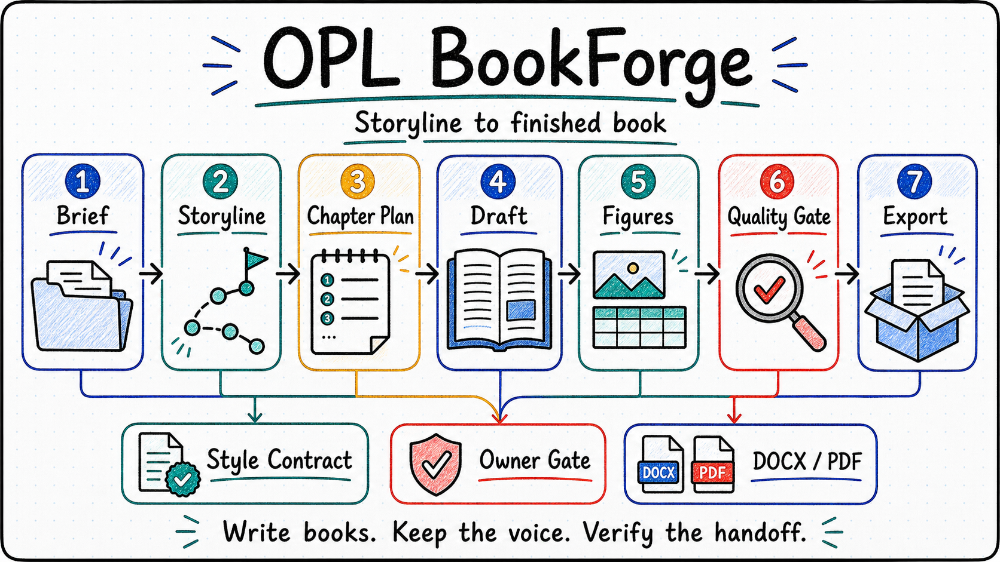

<p align="center">
  
</p>

<p align="center">
  <a href="./README.md"><strong>English</strong></a> | <a href="./README.zh-CN.md">中文</a>
</p>

<h1 align="center">OPL BookForge</h1>

<p align="center"><strong>An OPL-standard book-writing agent for turning a storyline into a finished manuscript package</strong></p>
<p align="center">Storyline architecture · Chapter drafting · Figures and tables · Style control · Export handoff</p>

<!--
Owner: `opl-bookforge`
Purpose: `public_repository_entry`
State: `public_entry`
Machine boundary: Human-readable public entry. Machine truth remains in `contracts/`, `agent/`, OPL validator output, OMA Agent Lab evidence, pilot exports, owner receipts, typed blockers, and future runtime receipts.
-->

Writing a book is long-form delivery work. The hard part is keeping the reader promise, chapter logic, source grounding, voice, figures, tables, layout, and owner review on one line until the manuscript can be handed off.

`OPL BookForge` is built around that work:

- What is the book's promise, audience, argument arc, and chapter thesis chain?
- Which source material supports each chapter, figure, table, and claim?
- Can chapters keep one voice across many drafting and revision passes?
- Can the prose read like human editorial writing, with direct affirmative phrasing and concrete language?
- Can exported DOCX/PDF files, figure plans, table plans, style reports, and owner gates stay traceable?

It does not stop at a prompt for "write a book." It organizes a two-stage route from storyline architecture to book materialization, then keeps quality checks and handoff evidence attached to the same book project.

<table>
  <tr>
    <td width="33%" valign="top">
      <strong>Who It Serves</strong><br/>
      Authors, experts, researchers, educators, and operators turning source material into a coherent book
    </td>
    <td width="33%" valign="top">
      <strong>What It Organizes</strong><br/>
      Storyline, chapter thesis chain, manuscript body, figure and table plans, style contract, quality reports, exports, and owner gates
    </td>
    <td width="33%" valign="top">
      <strong>How To Start</strong><br/>
      Provide the book brief, audience, source corpus, voice expectations, and desired export handoff
    </td>
  </tr>
</table>

<p align="center">
  
</p>

## Core Highlights

**Storyline First**<br/>
BookForge starts with the book's premise, reader promise, source map, argument arc, chapter thesis chain, and style contract before materializing chapters.

**Book Materialization As A Stage**<br/>
The second stage produces chapter drafts, manuscript body, illustration plans, table plans, style reports, AI-flavor revision checks, layout QC, and export handoff refs.

**Voice And Style Stay Inspectable**<br/>
The style contract travels with the book project. Checks look for consistent terminology, concrete phrasing, affirmative editorial language, and repeated patterns that make prose feel generated.

**Figures, Tables, And Layout Are Part Of The Work**<br/>
BookForge treats figures, tables, captions, export shape, rendered pages, and layout review as book-delivery surfaces, not decoration after drafting.

**Owner-Gated Publication Boundary**<br/>
BookForge can produce evidence, drafts, exports, and typed blockers. Publication approval, owner acceptance, and production-ready claims still require the right owner receipts and runtime evidence.

**Built Through OMA And Agent Lab**<br/>
This baseline includes OPL Meta Agent takeover evidence, independent AI reviewer evidence, and an external-suite self-evolution pass. New-agent delivery must go through that loop rather than ending at scaffold readiness.

## One-Sentence Quick Start

You can start with prompts like:

- "Use this source corpus to shape a book storyline, define the reader promise, chapter thesis chain, and style contract, then stop for owner review."
- "Turn this approved storyline into a short book manuscript with chapter drafts, figure plans, table plans, style checks, layout QC, and DOCX/PDF export handoff."
- "Audit this manuscript for voice drift, AI-flavor phrasing, weak chapter transitions, missing figures or tables, and export-blocking layout issues."

## What It Helps With

- Turning notes, source packs, lectures, reports, or research material into a book-shaped storyline.
- Keeping chapter logic, evidence references, voice, and editorial constraints coherent across a manuscript.
- Planning illustrations and tables before export, with captions and placement intent.
- Running style consistency, AI-flavor, wording, layout, and export checks as part of the book route.
- Producing handoff evidence that distinguishes generated drafts from owner-accepted publication material.

## Current Delivery Focus

- `storyline-architecture`: premise, reader promise, argument arc, source map, chapter thesis chain, style contract, and owner handoff.
- `book-materialization`: chapter draft bundle, manuscript body, figure plan, table plan, style consistency report, AI-flavor revision report, layout QC, exports, and owner handoff.
- `OMA Agent Lab`: baseline takeover suite, AI reviewer evaluation, mechanism proposal refs, external-suite self-evolution, and no-patch work-order receipt.
- `real book pilot`: a short-book pilot produced storyline artifacts, manuscript body, two PNG figures, table plan, DOCX/HTML/PDF exports, rendered PDF pages, quality receipts, and typed owner blockers.

## Current Boundary

- `OPL BookForge` is an OPL-standard Foundry Agent domain pack for book authoring.
- OPL owns generated interfaces, framework runtime projection, Agent Lab, work-order execution, registry/discovery, and promotion gates.
- BookForge owns book-domain truth, manuscript quality rules, style policy, figure/table planning, export/publication verdict boundaries, artifact authority, memory body, and owner receipts.
- Current evidence supports structural baseline, generated interface descriptors, OMA Agent Lab evaluation, and a real short-book pilot with export/render checks.
- Current evidence does not authorize a production-ready book-writing claim. The real pilot remains `passed_with_owner_gate_blocker` / `production_ready_claim_allowed=false` until human owner acceptance and direct `opl-bookforge` runtime CLI or hosted artifact-handoff parity evidence exist.

<details>
  <summary><strong>Technical OPL / operator boundary</strong></summary>

- The package exposes action contracts for `shape-storyline` and `materialize-book`; current generated MCP/OpenAI/AI SDK descriptors are descriptors only unless a runtime surface proves execution.
- `scripts/verify.sh` validates the OPL standard scaffold and generated interface descriptors through the local OPL CLI.
- OMA evidence lives under `docs/evidence/oma-agent-lab/`.
- The real pilot evidence lives under `docs/evidence/production-readiness/bookforge-real-book-pilot-2026-06-18/`.
- Pilot exports include DOCX, HTML, PDF, rendered pages, generated figures, quality receipts, and typed owner blockers. They are evidence artifacts, not owner publication acceptance.
- Scaffold validation, generated interface readiness, OMA takeover evidence, external-suite no-patch receipts, pilot exports, or rendered pages cannot become owner receipt, publication approval, production readiness, or hosted runtime parity by themselves.

</details>

## How To Read This Repository

1. Potential users should start here, then continue to the [Docs Guide](./docs/README.md).
2. Technical readers should read [Project](./docs/project.md), [Status](./docs/status.md), [Architecture](./docs/architecture.md), [Invariants](./docs/invariants.md), and [Decisions](./docs/decisions.md).
3. Operators should inspect `contracts/`, `agent/`, `docs/evidence/oma-agent-lab/`, and the real pilot evidence pack before making readiness or owner-acceptance claims.

## Agent And Operator Quick Start

<details>
  <summary><strong>Start here if you are handing this repo to Codex or another agent</strong></summary>

- Cloning this repo does not install the OPL Framework or a hosted BookForge runtime. If hosted execution is needed, prepare the current `one-person-lab` checkout or release bundle first.
- Read this README, [Docs Guide](./docs/README.md), [Status](./docs/status.md), and `AGENTS.md` before editing.
- Treat `OPL BookForge` as the book-domain owner and OPL as generated/runtime surface owner.
- Use OMA / Agent Lab evidence when evaluating the baseline. Do not stop at scaffold or interface validation when claiming a new-agent delivery is complete.
- Keep publication, export acceptance, and production-ready claims fail-closed until owner receipts and runtime parity evidence exist.

</details>

## Commands

```bash
scripts/verify.sh
python3 docs/evidence/production-readiness/bookforge-real-book-pilot-2026-06-18/tools/verify_pilot.py
```

`scripts/verify.sh` runs OPL scaffold and generated-interface validation. The pilot verifier checks the existing pilot evidence pack, exports, rendered pages, style scan, figures, and owner-gate blockers.

## Further Reading

- [Docs Guide](./docs/README.md)
- [Project](./docs/project.md)
- [Status](./docs/status.md)
- [Architecture](./docs/architecture.md)
- [Invariants](./docs/invariants.md)
- [Decisions](./docs/decisions.md)
- [Contracts](./contracts/)
