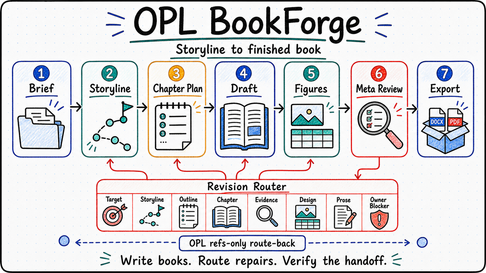

<p align="center">
  
</p>

<p align="center">
  <a href="./README.md">English</a> | <a href="./README.zh-CN.md"><strong>中文</strong></a>
</p>

# OPL Book Forge

OPL 书籍写作领域包，负责故事线设计、章节生产、来源与风格审查、图表、
出版校样和导出交接。Book Forge 持有书籍语义、产物、质量、记忆和接受边界；
OPL Framework 提供共享执行与生成接口。

规范 Agent 和 Package id 为 `obf`；仓库、domain 与 Codex Plugin 使用
`opl-bookforge` 作为定位符。



## 开始一本书

提供书籍说明、目标读者、材料包、声音要求、目标篇幅和交接目标。例如：

- “用这批材料梳理故事线，定义读者承诺和章节论点链，交给负责人审阅。”
- “把已确认故事线写成逐章 Markdown，包含图表、来源与风格审查，以及审阅 PDF。”
- “审查整本书，判断返修应从故事线、章节功能、证据、出版设计还是局部文字开始。”

`shape-storyline` 到故事线交接结束。已有接受的故事线 refs 后，
`materialize-book` 进入生产规划，再推进章节写作、来源与风格完整性审查、
出版校样交接。审阅 PDF、出版校样和最终导出有各自的证据与负责人接受要求。
[架构](docs/architecture.md) 说明阶段模型，[状态](docs/status.md) 说明当前证据边界。
保留的短书试运行是带负责人阻塞的历史证据，不能证明当前五阶段执行、
独立 Package 发布或生产可用。

## 安装

通过 OPL 的标准软件包入口安装：

```bash
opl packages install obf --json
opl packages status --package-id obf --json
```

正式发布渠道为 `ghcr.io/gaofeng21cn/one-person-lab-packages/obf`，不可变版本用于精确引用，`latest-stable` 指向当前版本。OPL 与原生插件管理器负责安装和更新；不通过独立 GitHub Release 页面或附件分发。

安装后新建任务以加载专业技能。软件包安装、运行可用性和领域验收分别记录；具体边界见[当前状态](./docs/status.md)。

## 验证

修改前阅读 [AGENTS.md](AGENTS.md)，通过[文档导览](docs/README.md) 找到主题负责人。
克隆本仓不等于安装 Framework 或托管运行时。验证脚本默认使用同级 Framework
检出目录；使用其他位置时设置 `OPL_BIN` 和 `OPL_FRAMEWORK_ROOT`。

| 命令 | 执行的检查 |
| --- | --- |
| `scripts/verify.sh` | 本地快速政策与合同检查 |
| `scripts/verify.sh structural` | 政策检查加 Framework agent check 和 source-hygiene 回读 |
| `scripts/verify.sh helpers` | Native helper probe、adapter 和图像 authority handler |
| `scripts/verify.sh pdf` | 真实审阅 PDF 与出版校样的编译、渲染路径 |
| `scripts/verify.sh full-local` | 本地政策、helper、PDF、handler 并集 |
| `scripts/verify.sh full` | 本地并集加 Framework 结构回读 |

PDF 执行需要 Pandoc、XeLaTeX、声明的渲染工具，以及当前 Python 环境中的 Pillow
用于机器页面检查。`uv run --with pillow scripts/verify.sh full-local` 可提供独立
验证环境，无需向源码检出目录添加依赖。
[Native helpers](runtime/native_helpers/README.md) 说明依赖诊断、参数、产物角色和
handler 限制。PDF 门禁负例直接调用规范 gate，避免重复编译。

历史试运行可以独立检查：

```bash
python3 docs/evidence/production-readiness/bookforge-real-book-pilot-2026-06-18/tools/verify_pilot.py
```

每个命令只证明其实际检查的层面。书籍、出版或导出接受仍需要对应的领域产物和
负责人回执。

## 参考入口

- [文档职责与生命周期](docs/README.md)
- [Agent 入口与方法](agent/README.md)
- [合同](contracts/)
- [证据包](docs/evidence/README.md)
