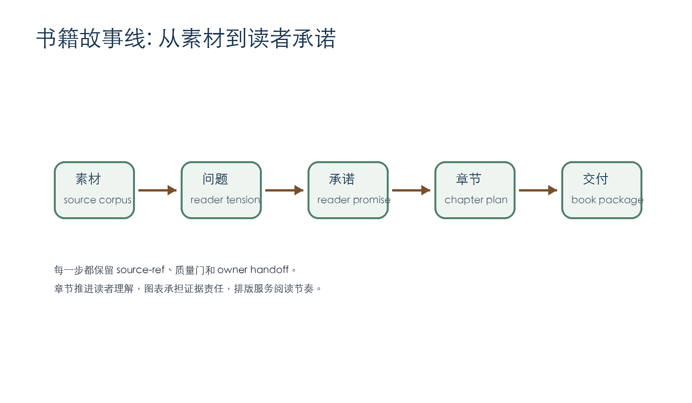
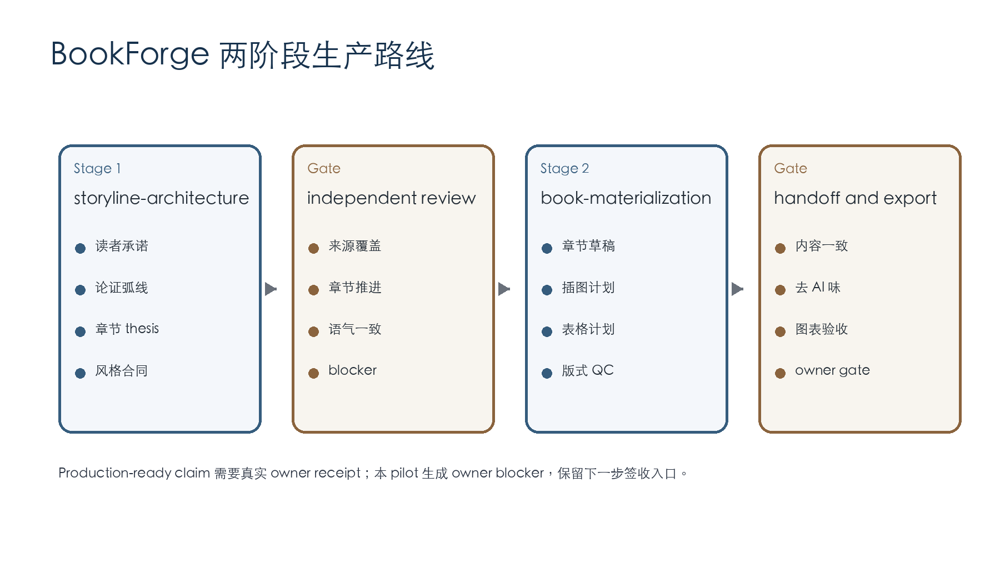

# 目录

- 前言
- 第一章 写作从读者承诺开始
- 第二章 故事线给素材排序
- 第三章 章节草稿承接 thesis
- 第四章 图表承担证据责任
- 第五章 交付依赖质量门
- 结语

# 前言

BookForge 处理的是一本书的完整交付路线。它先固定读者承诺，再把承诺推进到章节、图表、排版和签收证据。这样的路线让写作有稳定方向，也让审阅者能沿着 artifact、quality gate 和 owner handoff 复核每一步。

这本 pilot 手册使用 BookForge 仓库自身作为 source corpus。输入来自 stage control plane、action catalog、prompt、quality gate 和 OMA 评估记录。正文只使用这些 source-ref 支撑的判断，并把缺少 owner acceptance 的位置写成 typed blocker。

# 第一章 写作从读者承诺开始

一本书需要先回答读者获得什么。BookForge 在 `storyline-architecture` 阶段固定 premise、audience、reader promise 和 central argument。这个阶段的产物让后续章节知道自己要服务的判断，也让 owner 能在正文扩写前检查方向。

读者承诺承担两个作用。第一，它限定书的范围。第二，它让质量检查拥有明确基准。章节写得流畅仍然可能偏题；source-ref 很完整也可能缺少论证运动。reader promise 把这些问题提前暴露出来。

在本 pilot 中，读者承诺是：owner-operator 能判断书籍写作智能体是否真正跑过书籍项目，并能复核 source-ref、quality gate、export check 和 owner blocker。这句话直接决定章节安排。第一章解释承诺，第二章解释故事线，第三章进入正文生成，第四章处理图表，第五章回到验收。

| 读者问题 | BookForge 回答 | 证据位置 |
|---|---|---|
| 这本书为谁写 | OPL 系列 agent owner-operator | `inputs/voice-and-audience.md` |
| 书稿如何避免散 | 章节 thesis 固定推进关系 | thesis-chain |
| 产物如何被验收 | quality gate 加 owner handoff | gate receipts |

# 第二章 故事线给素材排序

故事线阶段把素材变成读者可以跟随的路径。BookForge 先识别 source corpus 支持的判断，再安排每章承担一个推进动作。这个动作可以是定义范围、建立框架、展开执行、说明证据，或关闭验收。

本 pilot 的 source corpus 主要来自十个本地 source-ref。`contracts/stage_control_plane.json` 给出两个阶段和 handoff 规则；`agent/prompts/*` 给出产物要求；`agent/quality_gates/*` 给出 pass 条件和 fail-closed 条件；`docs/status.md` 和 OMA reviewer evaluation 说明当前成熟度边界。

故事线产物必须保留风险和 owner 决策。缺少这些内容，第二阶段会把未确认问题写进正文，后续审阅只能返工。本 pilot 把 owner topic approval、final manuscript acceptance、layout acceptance 和 direct runtime parity 标成 owner decisions。这样做让书稿能够继续生成，也让 production-ready claim 保持真实。

# 第三章 章节草稿承接 thesis

章节草稿的任务是推进 thesis。每章开头先给出判断，再用 source-ref 解释判断的操作含义。这样的写法让读者不断获得新信息，避免章节之间重复同一层意思。

BookForge 的 `book-materialization` prompt 要求输出 chapter drafts、illustration specs、table specs、style consistency report、AI-flavor revision report、layout QC report 和 owner handoff packet。本 pilot 逐项生成这些 artifact，并把它们放入同一个 evidence pack。审阅者可以从 manuscript 进入正文，也可以从 receipts 进入验收状态。

章节写作采用同一套术语。`故事线` 表示全书路径，`chapter thesis` 表示章节职责，`source-ref` 表示证据锚点，`quality gate` 表示独立检查，`owner handoff` 表示人类签收入口。术语稳定后，书稿读起来更像人工编辑过的手册，读者不用在多个同义词之间切换。

| 章节 | thesis | source refs | draft status |
|---|---|---|---|
| 第一章 | 读者承诺给写作设定目标 | S1, S2, S5 | drafted |
| 第二章 | 故事线把 source-ref 排成论证弧线 | S3, S5, S7 | drafted |
| 第三章 | 章节草稿承接 thesis 并保持风格 | S6, S8 | drafted |
| 第四章 | 图表承担来源和复核责任 | S6, S8 | drafted |
| 第五章 | 交付必须经过质量门和 owner gate | S1, S8, S9, S10 | drafted |

# 第四章 图表承担证据责任

图表进入书稿时要说明用途、来源和检查标准。BookForge 把图片和表格视为 meaning-bearing elements。图片帮助读者看到结构，表格帮助读者比较证据。每个图表都需要 placement、source boundary 和 review criteria。

本 pilot 生成两张确定性 PNG。第一张展示从素材到读者承诺的故事线，第二张展示两阶段生产路线。它们使用本地脚本生成，来源边界清楚，尺寸可检查，文件 hash 可记录。表格则用于呈现读者问题、章节 thesis 和质量门结果。

这样的图表计划让排版检查有对象。layout QC 可以检查图片是否存在、尺寸是否足够、caption 是否靠近图片、表格是否有标题行、列宽是否适合内容。图表只承载来源支持的事实。

| artifact | purpose | placement | review criterion |
|---|---|---|---|
| `figure-01-storyline-arc.png` | show how source material becomes reader promise | after preface | nonblank PNG, readable labels, source boundary recorded |
| `figure-02-two-stage-route.png` | show stage and gate sequence | chapter 2 | nonblank PNG, stage names match contracts |
| reader question table | map reader need to artifact evidence | chapter 1 | each row has evidence location |
| chapter thesis table | show chapter movement | chapter 3 | each chapter has source refs and status |

# 第五章 交付依赖质量门

BookForge 的交付结论来自证据链。结构验证说明 repo 形态有效；Agent Lab takeover 说明 OMA 能读取和评估 agent package；pilot stage run 说明真实书籍项目可以产生 storyline、manuscript、图表计划和导出文件。production-ready claim 还需要 owner receipt。

本 pilot 的质量门检查四组内容。内容一致性检查章节是否沿着 reader promise 推进。风格一致性检查术语、语气、段落节奏和过渡。AI-flavor 检查删除空泛套话和机械化转折。排版检查覆盖 DOCX、HTML、PDF、图片和表格。

当前 closeout 应保持谨慎。两个 stage 已经产生 artifact，导出链路可以被本地工具复核，质量 gate 给出 pass-with-owner-blocker。最终 production-ready claim 仍等待 owner 对真实出版意图、正文质量和导出样式签收。

# 结语

BookForge 的核心价值是把写作交付变成可审计工作流。它把故事线、章节、图表、措辞、排版和 owner handoff 放在同一条证据链中。pilot 运行证明这条链可以产出一本可审阅的短书，也清楚留下 final owner acceptance typed blocker。下一步由 owner 阅读导出文件，选择签收、返修，或扩大到更长的真实书籍项目。
